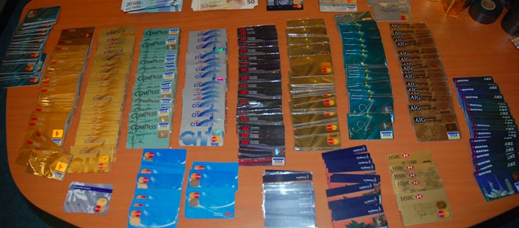

### Description



Pour vérifier si un numéro de carte bancaire est valide, la formule de Luhn est utilisée.

La formule vérifie un nombre par rapport à des chiffres de contrôle, qui sont généralement ajouté à un numéro de compte partiel pour générer le numéro de compte complet. Ce numéro de compte doit réussir le test suivant:

1- Du chiffre le plus à droite (chiffre de contrôle), en se déplaçant vers la gauche 2 à 2, doubler la valeur. Si le double d'un chiffre de contrôle est supérieur à 9 (par exemple, 7 × 2 = 14), alors additionner les chiffres du produit (par exemple, 12: 1 + 2 = 3, 14: 1 + 4 = 5).

2- Prenez la somme de tous les chiffres

3- Si le total modulo 10 est égal à 0 (si le total se termine par zéro) alors, selon la formule de Luhn, le nombre est valide; sinon, ce n'est pas valide.

Exemple du calcul de la formule et vérification du résultat :

Contrôle du numéro : 1556 9144 6285 339

Pos1 | Pos2 | Pos3 | Pos4 | Pos5 | Pos6 | Pos7 | Pos8 | Pos9 | Pos10 | Pos11 | Pos12 | Pos13 | Pos14 | Pos15 | 
--- | --- | --- | --- | --- | --- | --- | --- | --- | --- | --- | --- | --- | --- | ---
1 | `5` | 5 | `6` | 9 | `1` | 4 | `4` | 6 | `2` | 8 | `5` | 3 | `3` | 9
1 | 10 | 5 | 12 | 9 | 2 | 4 | 8 | 6 | 4 | 8 | 10 | 3 | 6 | 9
1 | 1 | 5 | 3 | 9 | 2 | 4 | 8 | 6 | 4 | 8 | 1 | 3 | 6 | 9

```
1 + 1 + 5 + 3 + 9 + 2 + 4 + 8 + 6 + 4 + 8 + 1 + 3 + 6 + 9 = 70
```

70 mod 10 = 0, le numéro de carte est *valide*

Contrôle du numéro : 6363 1811 2857 7650

Pos1 | Pos2 | Pos3 | Pos4 | Pos5 | Pos6 | Pos7 | Pos8 | Pos9 | Pos10 | Pos11 | Pos12 | Pos13 | Pos14 | Pos15 | Pos16 | 
--- | --- | --- | --- | --- | --- | --- | --- | --- | --- | --- | --- | --- | --- | --- | ---
`6` | 3 | `6` | 3 | `1` | 8 | `1` | 1 | `2` | 8 | `5` | 7 | `7` | 6 | `5` | 0
12 | 3 | 12 | 3 | 2 | 8 | 2 | 1 | 4 | 8 | 10 | 7 | 14 | 6 | 10 | 0
3 | 3 | 3 | 3 | 2 | 8 | 2 | 1 | 4 | 8 | 1 | 7 | 5 | 6 | 1 | 0

```
3 + 3 + 3 + 3 + 2 + 8 + 2 + 1 + 4 + 8 + 1 + 7 + 5 + 6 + 1 + 0 = 57
```

57 mod 10 = 7 <> 0, le numéro de carte n'est *pas valide*


### Input

Ecrire un fonction qui prend en entrée un paramètre prenant une chaine de caractères ou une liste de chaine de caractères correspondant au lien vers le fichier (ou la liste de fichiers) des numéros de cartes.
Le fichier sera au format txt, un numéro de carte à chaque ligne (pas de séparateur).

Exemple du contenu d'un fichier CSV :

    ## 6011 5940 0319 9511
    ## 5537 0213 6797 6815
    ## 5574 8363 8022 9735
    ## 3044 8507 9391 30
    ## 6370 1675 9034 6211 774

### Output

La fonction retourne un vecteur (ou une liste de vecteur) contenant pour chaque ligne la valeur 1 si le numéro de carte est pas valide, 0 sinon.

Par exemple :

    resultat <- cbverifGroupe9("data/cbverif.txt")
    print(resultat)
    ## [1] 0 1 0 0 1

    class(resultat)

    ## [1] "numeric"

### Contraintes

La fonction doit être nommée de la façon suivante : `cbverifGroupeN` avec N le numéro du groupe travaillant sur la fonction.

    cbverifGroupe9 <- function(path=list()) {
	...
	return(res)
    }

-   Les numéros de cartes bleues peuvent faire entre 12 et 19 digits.
-   Les numéros sont séparés par un espace tous les 4 digits, les espaces doivent être ignorés.
