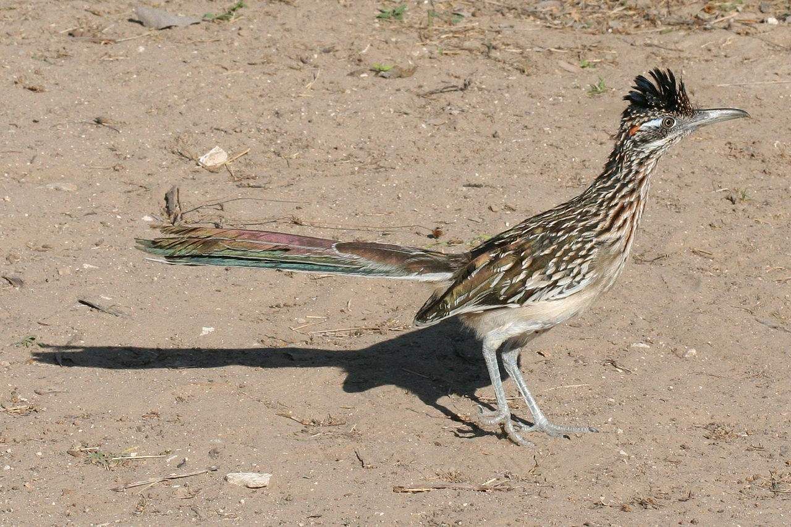

### Description

Vous arrivez dans votre nouvelle société pour remplacer le poste de
quelqu'un qui a quitté la société récemment. Vous ne connaissez pas
cette personne, et pourtant, vous voilà face à tous ses projets
effectués ces 4 dernières années. Votre Manager entre dans le bureau en
vous expliquant qu'il y a une urgence sur le projet "bipbip", les temps
d'exécution des algorithmes automatiques sont beaucoup trop longs
empéchant le client de pouvoir utiliser la plateforme. Votre manager est
tendu ! Sous vos yeux apparait le dossier "bipbip\_R", vous vous
apprétiez justement à le regarder avant que votre manager ne rentre dans
les bureaux.

### Input

Trouvez un moyen de réduire le temps d'exécution de la fonction ci
dessous. Vous êtes libre d'utiliser ce que vous voulez, la seule
contrainte est que vous devez rester dans l'environnement R.

Fonction :

    ## Fonction permettant de calculer le taux de victoire du coyotte sur la Saison 2 par groupe de compléxité des pièges
    bipbip <- function() {
      
      # Lecture du fichier
      download.file("https://raw.githubusercontent.com/OehlR/exercices-introdatascience/master/data/apetitius_giganticus.csv", destfile = "apetitius_giganticus.csv", method = "curl")
      data <- read.delim("apetitius_giganticus.csv",sep=",",header=T)
      data.a <- data[ifelse(data[,which(colnames(data)=="Saison")]=="Saison 2",TRUE,FALSE),]
      
      # Calcul des fréquences cumulés
      for(col in 3:4) {
        data.a <- data.a[order(data.a[,col]),]
        data.a <- cbind(data.a,cumsum(data.a[,col]))
        data.a[,col+3] <- data.a[,col+3]/sum(data.a[,col])
      }
      
      # Calcul de la PMG
      data.a$PMG1 <- ifelse(data.a[,6] <= 0.5,"P","")
      data.a$PMG1 <- ifelse(data.a[,6] > 0.5 & data.a[,6] <= 0.8,"M",data.a$PMG1)
      data.a$PMG1 <- ifelse(data.a[,6] > 0.8 & data.a[,6] <= 1.0,"G",data.a$PMG1)
      
      # Calcul d'une colonne Bidon pour calculer le nombre de lignes
      data.a  <- cbind(data.a,"BID" = rep(1,nrow(data.a)))
      
      # Calcul du tableau de statistique
      res1 <- aggregate(data.a$CoyoteWin,list(data.a$PMG1),sum)
      res2 <- aggregate(as.numeric(data.a$BID),list(data.a$PMG1),sum)
      res <- merge(res1,res2,by="Group.1")
      colnames(res) <- c("PMG","Nb Victoire","Nb tentative")
      res$Taux <- round(res[,2]/res[,3],4)

      # Tri du tableau de résultat
      res <- res[order(res$PMG,decreasing=T),]
      
      rownames(res) <- NULL
      
      return(res[,c("PMG","Taux")])
      
    }
    system.time(bipbip())

### Output

La fonction doit retourner exactement le même résultat que la version
non optimisée. Le test d'égalité des résultats se fera par la fonction
`all.equals()`

### Informations

La fonction doit s'appeler `votreprenom_bipbip()`

Ici, la complexité du piège est regroupée en 3 catégories : 1- Les 50%
des pièges les moins complexe (selon la note de compléxité) 2- Les 30%
des pièges suivants (selon la note de compléxité) 3- Les 20% des pièges
les plus complexes (selon la note de compléxité)
