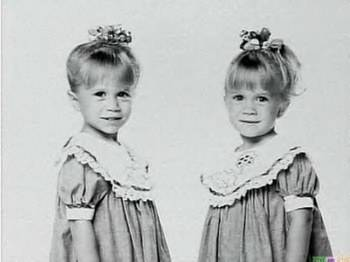

### Description

Mary-Kate et Ashley Olsen sont 2 soeurs jumelles américaines connues
pour avoir joué dans la sitcom "La Fête à la maison". Au dela de la
ressemblance physique, elles ont beaucoup de points en communs (parents,
parcours professionnel, petit copain, ...).

Ecrire une fonction en R qui permet de retrouver les jumeaux dans une
liste d'individus. Définissions les jumeaux comme les individus ayant
une distance statistique nulle (d(i,j)==0 avec i != j)

### Input

La fonction doit accepter en parametre un `data.frame` contenant la
liste des individus et leurs descripteurs. La premiere colonne du
`data.frame` sera l'identifiant de l'individu les autres colonnes (les
descripteurs) sont sous la forme d'indicatrice (booleen 1/0).

Par exemple :

    df <- read.csv("data/olsen.csv")
    print(df)

    ##    id v1 v2 v3 v4 v5 v6 v7 v8
    ## 1   1  0  0  0  1  1  0  0  1
    ## 2   2  0  0  1  1  1  1  0  0
    ## 3   3  1  1  1  0  0  1  0  1
    ## 4   4  0  1  0  0  0  1  1  1
    ## 5   5  1  1  0  0  1  0  0  0
    ## 6   6  1  1  1  0  0  1  0  1
    ## 7   7  0  1  0  0  1  0  1  1
    ## 8   8  0  0  0  1  0  1  1  1
    ## 9   9  0  0  1  1  1  1  0  0
    ## 10 10  1  1  1  0  0  1  0  1

### Output

La fonction retourne un data.frame contenant les jumeaux trouvés. Un
couple de jumeaux par ligne. 2 colonnes correspondant au id des deux
jumeaux.

Par exemple :

    print(resultat)

    ##   jum1.id jum2.id
    ## 1       2       9
    ## 2       3       6

    class(resultat)

    ## [1] "data.frame"

### Contraintes

-   Seul les **jumeaux** doivent etre restitués (pas les triplés,
    quadruplés, etc)
-   Taille du data.frame N \<= 10e4
-   Le nombre de descripteur P \<= 16
-   On peut supposer qu'il n'y aucune valeur manquante
